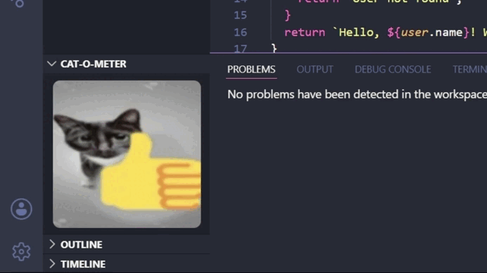

<h1 align="center">Cat-O-Meter 🐱</h1>

<p align="center">
  <i>Leer en otro idioma: <a href="https://github.com/EvePulido/Cat-O-Meter/blob/main/README.md" target="_blank">English</a></i>
</p>

<p align="center">
  <b>Reacciones de gatos según qué tan roto esté tu código.</b>
</p>

<p align="center">
  <a href="https://marketplace.visualstudio.com/items?itemName=EvePulido.cat-o-meter">
    
  </a>
  <a href="https://open-vsx.org/extension/EvePulido/cat-o-meter">
    
  </a>
  <a href="https://github.com/EvePulido/Cat-O-Meter/blob/main/LICENSE">
    
  </a>
</p>

<p align="center">
  
</p>

## Tabla de Contenidos
- [Características](#características)
- [Niveles de severidad](#niveles-de-severidad)
- [Cómo usar](#cómo-usar)
- [Personalización y Contribuciones](#personalización-y-contribuciones)
- [Instalación para desarrollo](#instalación-para-desarrollo)

---

Cat-O-Meter es una extensión para VS Code que ancla una vista dinámica de michis en tu barra lateral (*Sidebar*). Esta colección de gatos reacciona en tiempo real a la cantidad de errores en el archivo que estás editando. ¿Código limpio? Verás gatos felices y relajados. ¿Se acumulan los errores? Prepárate para una variedad de gatos reaccionando al colapso absoluto.

## Características

* **Selección dinámica:** Cada nivel de error tiene su propio conjunto de gatos. La extensión elige uno aleatoriamente cuando cambia el estado.
* **Actualización en tiempo real:** Las reacciones se actualizan al escribir o guardar, reflejando el estado actual del archivo.
* **4 niveles de severidad:** Desde código limpio hasta caos total, con una colección distinta en cada nivel.
* **Integración discreta:** Funciona desde el panel lateral sin interrumpir tu flujo de trabajo.
* **Enfoque en Privacidad:** Funciona 100% sin conexión. Realiza cero peticiones de red, manteniendo tu código completamente privado.
* **Rendimiento Optimizado:** Recursos multimedia altamente comprimidos en WebP que garantizan una carga instantánea y un peso mínimo.
* **Transiciones Suaves:** Efectos de fundido suaves con CSS para cambios de estado fluidos.

## Niveles de severidad

El tipo de gato que aparece depende del número de errores en tu archivo activo:

| Nivel | Errores | Descripción de la Colección |
| :--- | :--- | :--- |
| `zen` | 0 | No lo toques 😎 |
| `mild` | 1 - 3 | Nada que un console.log no arregle 🤔 |
| `stressed` | 4 - 7 | Cambios menores 😌 |
| `chaos` | 8+ | Esto funcionaba ayer... 😰 |

## Cómo usar

1. Haz clic en el icono de **Cat-O-Meter** en la barra de actividades (barra lateral izquierda).
2. Abre cualquier archivo de código en tu editor.
3. ¡Empieza a programar! El michi actualizará su reacción automáticamente según los errores encontrados en tu archivo activo.

## Personalización y Contribuciones

Si quieres expandir la colección y agregar tus propios michis o memes:

1. Agrega tus imágenes a la carpeta `/media`. (Se recomienda usar formato cuadrado y formato WebP para una mejor experiencia visual y optimización de peso).
2. Abre el archivo `src/severityLevels.ts` y modifica el arreglo `SEVERITY_LEVELS`. Simplemente agrega los nombres de tus nuevos archivos al arreglo de `assets` del nivel correspondiente. El código se encarga de la aleatoriedad automáticamente.

*Consejo: ¡Los Pull Requests son bienvenidos! Siéntete libre de compartir tus michis favoritos con la comunidad.*

## Instalación para desarrollo

Si quieres clonar el repositorio y jugar con el código fuente en tu entorno local:

```bash
# 1. Clona el repositorio
git clone https://github.com/EvePulido/Cat-O-Meter.git
cd cat-o-meter

# 2. Instala las dependencias
npm install

# 3. Compila el código
npm run compile

# 4. Abre la carpeta en VS Code y presiona F5
# Esto abrirá una nueva ventana (Extension Development Host) para probar la extensión.
```

Código limpio = gatos felices.  
Errores = contenido de calidad 🐱💥

---

¡Disfruta de un poco de compañía felina mientras programas!
